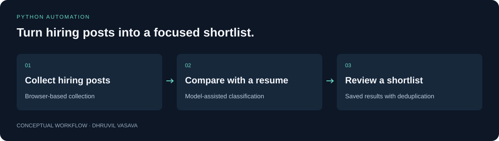

# LinkedIn Job Leads

**Turn hiring posts into a focused shortlist.**

A personal job-search tool that collects hiring posts and compares them with a resume, helping a developer decide which opportunities to review first.

For job seekers who want a more organized review process, with saved progress and fewer repeated leads.



[Quick start](#try-it-locally) · [Technical guide](docs/TECHNICAL_GUIDE.md) · [Checks](https://github.com/Dhruvil151/linkedin-job-leads/actions) · [Portfolio](https://github.com/Dhruvil151)

## A simple example

A developer looking for Node.js work collects hiring posts, ranks their relevance to a resume, and reviews the stronger matches. Repeated posts are tracked so later runs can avoid unnecessary work.

## What it does

- Collect posts through a dedicated Chrome profile.
- Classify and score posts with a configured Gemini model.
- Extract application emails explicitly present in post text.
- Save progress in SQLite and optionally send reports through Telegram.

## Try it locally

```sh
python -m venv .venv
```

Activate the environment, then:

```sh
python -m pip install -r requirements.txt
python -m unittest discover -s tests -v
```

Requires Python 3.10+. Live collection also requires Chrome and your own signed-in account; scoring requires your own Gemini configuration. Follow the technical guide for the dedicated browser profile and daily runner.

## How it is built

**Python · Selenium · Gemini · SQLite · PDF parsing · unittest**

The daily workflow persists its state in SQLite, making interrupted scoring resumable and tracking delivery separately. This is more reliable than treating each scheduled run as a fresh scrape.

See the [technical guide](docs/TECHNICAL_GUIDE.md) for setup details, architecture, and implementation boundaries.

## Engineering decisions

### Persist progress between runs

SQLite records candidates, scoring progress, deduplication, and delivery state. An interrupted run can resume and avoid treating every post as new.

### Separate ranking from verification

A model ranks post relevance, while original post content remains the evidence. Scores help prioritize manual review; they do not prove that a vacancy exists.

### Make delivery optional

Local reporting can run without Telegram. Users can inspect results before enabling delivery, and credentials remain local.

## Checks and evidence

```sh
python -m unittest discover -s tests -v
```

Start with the [fictional sample walkthrough](examples/README.md) to understand the output without credentials, a resume, or a live browser. All sample scores are illustrative, not model evaluations.

The [publication validation report](VALIDATION.md) records earlier checks and their limits. GitHub Actions records checks for subsequent commits.

## Current scope

Personal automation, not an official LinkedIn integration. Selectors and provider access can change. Model scores are suggestions and do not verify that a role is available or suitable.


## License

Original project code and documentation are available under the [MIT License](LICENSE). Third-party dependencies and assets retain their own licenses; see [third-party notices](THIRD_PARTY_NOTICES.md).
